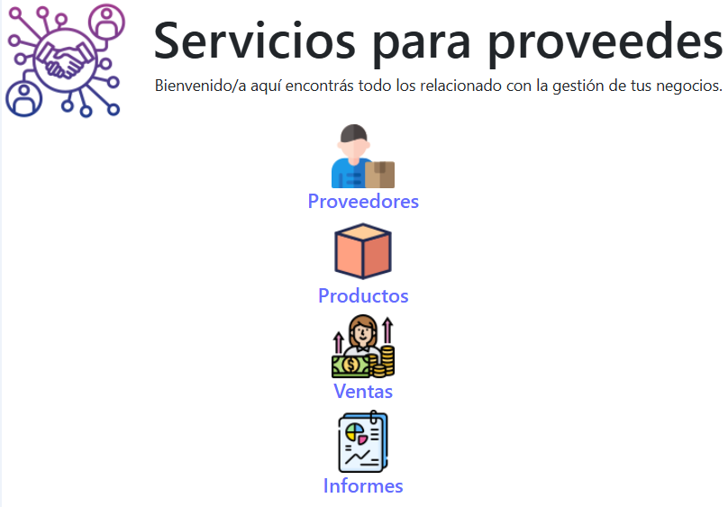

<p align="center">
  
</p>

<h1 align="center">Pro360</h1>
<p align="center"><i>Gestión completa de proveedores, productos y ventas.</i></p>

---

<p align="center">
  
  
  
  
</p>

## 🧾 Overview

**Pro360** is a modern web application designed to help suppliers manage their daily operations with ease and precision.

This application allows suppliers to:

🔍 Track and manage their **products, sales, and purchases**.  
📊 Generate reports to analyze **sales performance** and business trends.  
🧭 Use a **user-friendly interface** with icon-based navigation.  
⚡ Built using **Angular** with **Bootstrap**, ensuring full responsiveness.

Whether you're a solo supplier or a growing network, **Pro360** gives you the tools to stay organized and in control.

## 🚀 Demo

> 

## 📁 Project Structure

```plaintext
src/
├── assets/img/             # Icons and branding assets
├── app/
│   ├── components/         # Shared components like navbar
│   ├── pages/              # Feature modules (providers, products, etc.)
│   ├── app-routing.module.ts
│   ├── app.component.ts
│   └── app.module.ts
├── styles.css              # Global styles
```

## 🧠 Tech Stack
🔺 Angular 17+

🧭 Angular Router

🎨 Bootstrap 5

🧰 TypeScript

🖼️ HTML5 + CSS3

## 🗺️ App Routes
| Route        | Description                      |
| ------------ | -------------------------------- |
| `/`          | Home *(currently commented out)* |
| `/providers` | Supplier Management              |
| `/products`  | Product Management               |
| `/sales`     | Sales Overview                   |
| `/reports`   | Reporting Dashboard              |
| `**`         | 404 Error Page                   |

## 📸 UI Preview (Navigation Icons)
```html

<a routerLink="/providers">
  
  <h5>Proveedores</h5>
</a>
<a routerLink="/products">
  
  <h5>Productos</h5>
</a>
<a routerLink="/sales">
  
  <h5>Ventas</h5>
</a>
<a routerLink="/reports">
  
  <h5>Informes</h5>
</a>
```

## 🛠️ Installation
```bash
# Clone the repository
git clone https://github.com/danielrs89/pro360.git

# Navigate to the project folder
cd your-repo

# Install dependencies
npm install

# Run the development server
ng serve
```

## 📬 Author
Made with ❤️ by Daniè
- 📧 [dani89rosa@gmail.com]()
- 🔗 LinkedIn
- 🐙 GitHub

## 📢 Contribute
Pull requests and feedback are welcome!
Help improve this project by opening an issue or submitting a feature request.

## 📝 License
This project is licensed under the [MIT License]().